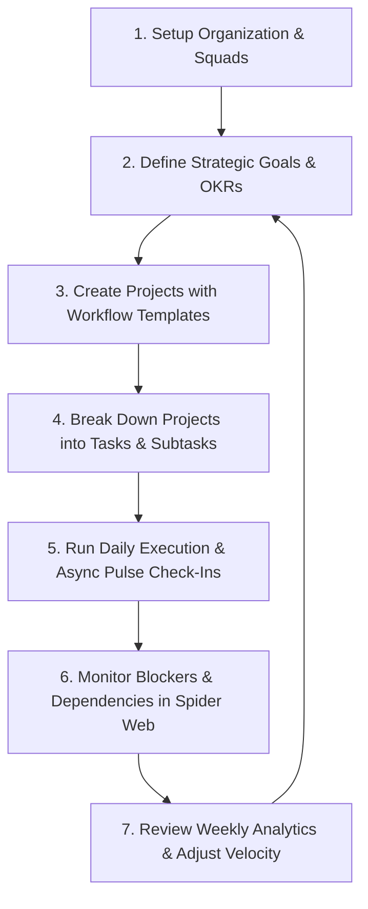

# Pulse — Intelligent Team Alignment & Execution Engine
**Product Specification, Feature Matrix & Operational Blueprint**

---

## 1. Executive Overview

### What is Pulse?
**Pulse** is a modern, enterprise-grade **Team Alignment & Execution Engine** designed to bridge the gap between high-level company strategy (OKRs), project execution, and daily ground-level engineering realities. 

Traditional project management tools (like Jira, Asana, or Monday.com) often devolve into administrative chore boards disconnected from strategic outcomes, while goal-tracking platforms (like Workboard or Lattice) stay isolated from day-to-day work. 

**Pulse unifies both worlds into a single, high-fidelity system:**
- **Bidirectional Traceability**: Connects company-wide strategic Objectives & Key Results (OKRs) directly to projects, tasks, squads, and individual contributors.
- **Asynchronous Daily Pulse & Bottleneck Engine**: Replaces time-consuming synchronous standups with high-signal daily check-ins that surface blockers, manager escalations, and accomplishment tracking in real time.
- **Multi-Dimensional Org Topology (Spider Web & Master-Detail Carousel)**: Interactive force-directed relationship graphs and master-detail carousels that visualize cross-team dependencies, multi-squad projects, and resource allocations at a glance.
- **Multi-Tenant Governance & RBAC**: Built from the ground up for modern businesses, multi-entity corporations, and agencies with isolated tenant workspaces, custom domain routing, role-based access control, and governed taxonomy tags.

---

## 2. Core Value Proposition: How Pulse Transforms Businesses

| Challenge in Traditional Tools | How Pulse Solves It | Business Impact |
| :--- | :--- | :--- |
| **Strategy-to-Execution Disconnect**<br>Teams work on tasks without knowing which company goal they advance. | Direct bidirectional linkage between Key Results and operational tasks with automated progress rollup. | **100% Goal Clarity**: Every dollar and hour invested is mapped directly to strategic outcomes. |
| **Silent Blockers & Late Escalations**<br>Engineers get blocked for days before anyone notices during weekly reviews. | Daily Pulse with one-click **"Escalate to Manager"** flags and task-linked blocker alerts. | **80% Faster Unblocking**: Managers receive instant notifications the exact moment a roadblock arises. |
| **Status Meeting Fatigue**<br>30–45 minute daily standups disrupt flow and deliver low actionable insight. | High-signal async check-ins with automatic task completion detection and team timelines. | **Save 3+ Hours/Week/Engineer**: Gives developers back uninterrupted deep work time. |
| **Siloed Multi-Team Dependencies**<br>Cross-functional projects fall through cracks between teams. | Multi-team project assignments and interactive **Relationship Spider Web & Carousel**. | **Zero Blindspots**: Instant visibility into cross-squad collaborations and cross-task blockers. |
| **Administrative Overhead & Complexity**<br>Complex software configurations overwhelm team members. | Clean, high-contrast monochrome design, keyboard shortcuts, and pre-built workflow templates. | **Rapid Onboarding**: Teams become productive within minutes of tenant activation. |

---

## 3. Comprehensive Feature Matrix

### 🏢 1. Multi-Tenant Organization & Access Control
- **Multi-Tenant Workspace Switcher**: Seamlessly toggle between multiple independent organizations or subsidiaries with isolated data stores, members, and projects.
- **Organization Creation & Onboarding Wizard**: Self-serve organization creation with industry-tailored starter templates and squad presets.
- **Waiting Room & Approval Gate**: Security gate for prospective members joining via invite links or org codes, requiring Admin/Manager approval before accessing confidential workspaces.
- **7-Tier Role-Based Access Control (RBAC)**:
  - `Admin`: Full workspace control, billing, member approval, tag governance, and org settings.
  - `Executive`: Company-wide visibility, OKR creation, executive dashboard, and analytics export.
  - `HR / People Ops`: Headcount management, capacity planning, team health overview, and check-in audits.
  - `Manager`: Squad management, blocker resolution, project lifecycle, and task assignment.
  - `TeamLead`: Sprint execution, squad coordination, and subtask reviews.
  - `Member`: Daily check-in logging, task execution, comment collaboration, and personal pulse tracking.
  - `Contractor`: Scoped access to assigned projects and tasks with capacity capping.

---

### 🎯 2. Strategic Goals & OKR Management
- **Hierarchical Objectives**: Define company-wide, department-level, or squad-specific strategic objectives.
- **Quantifiable Key Results**: Track measurable metrics with customizable units (`%`, `$`, `Users`, `Points`, `Count`), target values, and current progress.
- **Task Linkage**: Directly associate specific operational tasks to Key Results. As tasks are completed, KR progress indicators and objective health reflect real momentum.
- **Target Dates & Status Tracking**: Live status badges (`On Track`, `At Risk`, `Behind`, `Completed`) with deadline countdowns.

---

### 📦 3. Projects & Workstream Hub
- **Multi-Squad Collaboration**: Link projects to single squads or span across multiple teams (`Multi-Team` workstreams).
- **Workflow Templates**:
  - `SoftwareSprint`: Agile software iterations with velocity tracking.
  - `BugTracking`: Defect triaging, severity scoring, and resolution SLAs.
  - `MarketingCampaign`: Launch milestones, asset deliverables, and channel deadlines.
  - `ClientOnboarding`: Customer rollout checklists and stage-gate governance.
  - `GeneralOps`: Business operations and recurring workflow management.
  - `KanbanFlow`: Continuous delivery with WIP limits.
  - `SalesPipeline`: Deal stages, prospect touchpoints, and account onboarding.
  - `DesignSystem`: Component library governance and design-to-code tokens.
  - `ExecutiveStrategy`: Board-level initiatives and quarterly milestones.
- **Project Progress Engine**: Automated completion percentages calculated from weighted task completion states.
- **Dynamic Contributor Mapping**: Automatically maps project contributors across project leads, explicit members, linked squads, and task assignees.

---

### ⚡ 4. Tasks & Execution Engine
- **Multi-View Modes**:
  - **Kanban Board**: Drag-and-drop columns (`Todo`, `In Progress`, `At Risk`, `Blocked`, `Done`).
  - **Spreadsheet / Table View**: Bulk scanning with column sorting, quick filtering, and inline edits.
  - **Compact List View**: High-density execution view for power users.
- **Blocker Reason & Escalation Tracking**: Explicitly flag any task as `Blocked` with a mandatory reason that pings the assigned manager.
- **Interactive Subtask Checklists**: Break complex tasks into bite-sized sub-deliverables with individual assignees and one-click completion toggles.
- **Time Tracking & Capacity Estimations**: Log estimated vs. actual hours to analyze estimation accuracy and prevent burnout.
- **Task Dependencies**: Establish prerequisite task relationships (`dependsOnTaskId`) to prevent out-of-order execution.
- **Threaded Comments & Activity Logs**: In-task discussions with author timestamps, markdown notes, and edit histories.

---

### 💓 5. The Daily Pulse (Asynchronous Standup & Bottleneck Engine)
- **Daily EOD Check-In Modal**: A 60-second end-of-day workflow for every team member:
  - Auto-imports completed tasks for the day as accomplishments.
  - Allows manual accomplishment logging.
  - Captures active blockers with an optional **"Flag to Manager"** emergency toggle.
- **Daily Pulse Feed**: A chronological, organization-wide or squad-filtered timeline of daily check-ins.
- **Squad Bottleneck Radar**: Instantly highlights members reporting roadblocks or escalated blockers.

---

### 🕸️ 6. Relationship Explorer & Org Topology
Pulse features an interactive dual-mode relationship engine to visualize organizations:

```
                  ┌──────────────────────┐
                  │    0. Org Core       │
                  └──────────┬───────────┘
                             │
                  ┌──────────┴───────────┐
                  │      1. Squads       │
                  └──────────┬───────────┘
                             │
                  ┌──────────┴───────────┐
                  │     2. Projects      │
                  └──────────┬───────────┘
                             │
            ┌────────────────┴────────────────┐
            │                                 │
  ┌─────────┴──────────┐            ┌─────────┴──────────┐
  │3. People/Squad Lead│            │     4. Tasks       │
  └────────────────────┘            └─────────┬──────────┘
                                              │
                                    ┌─────────┴──────────┐
                                    │    5. Goals/OKRs   │
                                    └────────────────────┘
```

1. **Master-Detail Carousel Mode (Daily Driver)**:
   - Clean, keyboard-navigable card carousel (`←` / `→` arrow keys).
   - Drill-down navigation: Org -> Squads -> Projects -> Tasks / Members.
   - Intelligent task fallback: Viewing a contributor shows both their direct assigned tasks and workstreams in contributing projects.
   - Sibling peek previews to browse adjacent team members or tasks without leaving context.

2. **Spider Web Force Graph Mode (Exploratory Topology)**:
   - 5-Ring concentric force-directed interactive physics layout.
   - Zoom, pan, drag, and custom node pinning with local persistence.
   - **Focus Neighborhood Mode**: Select any node and filter graph depth to 1–4 hops to isolate dependencies without visual "hairballs".
   - **Filter Overlays**: One-click toggles for `All Relationships`, `Blockers Only` (isolating at-risk paths), and `Goals & OKRs Only`.

3. **Interactive Stacked Folder Sidebar**:
   - Collapsible hierarchical tree view with cascading badges.
   - Drag-and-drop tasks directly onto project folders to reassign workstreams.
   - Double-click inline project renaming and multi-team unlinking.

---

### 🏷️ 7. Governed Enterprise Tagging & Taxonomies
- **Scoped Taxonomy Management**: Create organization-wide tags governed by Admins.
- **Entity Scope Restriction**: Restrict tags to specific entity types (`Task`, `Project`, `Person`, `Goal`).
- **Muted Visual Hierarchy**: High-contrast, accessibility-tested background and border swatches.

---

### 📊 8. Analytics & Executive Intelligence
- **Velocity Metrics**: Track task completion velocities across sprints and weeks.
- **Resource & Capacity Heatmaps**: Compare committed workload hours against weekly squad capacity (`capacityHoursPerWeek`).
- **Data Export Suite**: Full export capabilities for all workspaces, projects, tasks, and members into structured **CSV** or **JSON** reports.

---

### 🔍 9. Global Productivity Tools
- **Command Palette / Omni-Search (`Cmd+K` / `Ctrl+K`)**: Instant search indexing all squads, projects, tasks, goals, members, and tags with keyboard navigation.
- **Unified Slide-Over Drawer**: Detailed side drawer to inspect, edit, and collaborate on any entity without navigating away from the current screen.
- **Activity Feed & Notifications**: Real-time notifications for task assignments, blocker escalations, and invite approvals.
- **Archive & Restore Engine**: Soft-delete safety net allowing recovery of archived projects, tasks, and goals.

---

## 4. Architectural Design & Tech Stack

Pulse is engineered with a modular, performance-first frontend and real-time backend:

- **Frontend Core**: React 19, TypeScript, Vite, React Router v7.
- **Styling & UI**: Tailwind CSS v4, Framer Motion (micro-interactions, spring physics, and view transitions), Lucide Icons.
- **Desktop Application**: Electron with native preloads and multi-platform packaging via `electron-builder`.
- **Backend & Persistence**: Supabase (PostgreSQL with Row Level Security), Firebase Hosting.
- **State & Sync Engine**: React Context + Custom Reducer with optimistic updates, local storage fallbacks, and multi-tenant scoping.

---

## 5. The Operational Blueprint: How to Implement & Use Pulse

Follow this step-by-step blueprint to roll out Pulse across your business:



---

### Step 1: Organization Setup & Governance
1. **Create Your Organization**:
   - Navigate to the welcome screen and click **"Create Organization"**.
   - Enter your company name, unique subdomain slug (e.g. `acme-corp`), and business domain.
2. **Configure Squads**:
   - Head to the **Teams** screen and create your core squads (e.g. `Engineering`, `Product Design`, `Marketing`, `Customer Success`).
   - Assign a **Team Lead** to each squad.
3. **Invite Team Members & Set Roles**:
   - Share the workspace invite link (`https://pulse-epicordia.web.app/acme-corp/join`).
   - As team members register, approve them in the **Waiting Room** and assign their RBAC role and squad.
4. **Establish Enterprise Tags**:
   - Go to **Admin Settings > Governed Tags** and set up standard taxonomies (e.g. `Q3-Priority`, `Customer-Escalated`, `Backend`, `Mobile`).

---

### Step 2: Establish Strategic Goals & Key Results (OKRs)
1. Navigate to the **Goals** screen.
2. Click **"+ New Goal"** to define top-level strategic objectives (e.g., *"Expand Enterprise ARR by 40%"* or *"Achieve 99.99% Platform Reliability"*).
3. Add 2–4 quantifiable **Key Results** per goal with clear target metrics and deadlines.

---

### Step 3: Launch Projects & Assign Squads
1. Go to the **Projects** screen and click **"+ New Project"**.
2. Select the optimal **Workflow Template** (e.g., `SoftwareSprint` for development, `MarketingCampaign` for product launches).
3. Link the project to its primary squad (or multiple squads if cross-functional).
4. Connect the project to its parent **Goal / OKR**.

---

### Step 4: Sprint Task Breakdown & Execution
1. Open the project in the **Tasks** screen or via the **Project Detail Panel**.
2. Create tasks with clear descriptions, estimated hours, and due dates.
3. Add checklist **Subtasks** and assign them to specific contributors.
4. Set dependencies where tasks block one another.

---

### Step 5: Daily Cadence — The Asynchronous Daily Pulse
1. **End-of-Day Check-in (Team Members)**:
   - At the end of each working day, members click the **"Daily Pulse"** button.
   - Completed tasks are automatically attached.
   - If blocked, the member writes a concise blocker note and checks **"Escalate to Manager"**.
2. **Morning Standup Review (Managers & Leads)**:
   - Managers review the **Daily Pulse Feed** and **Bottlenecks** callout in under 3 minutes.
   - Directly click into blocked tasks from the feed to reassign or resolve issues.

---

### Step 6: Dependency & Relationship Tracking
1. Open the **Relationships** screen.
2. **Daily Driver View (Carousel)**: Use the arrow keys to cycle through squads, projects, and members to verify workload distribution.
3. **Strategic Review (Spider Web)**:
   - Switch to the **Spider Web** view.
   - Toggle the **"Blockers Only"** filter to see which critical paths are stalling progress.
   - Click on any squad or project node to focus on its 2-hop neighborhood.

---

### Step 7: Weekly Analytics & Sprint Retrospective
1. Open the **Analytics** screen.
2. Review completion velocity, hours logged vs. capacity, and recurring bottleneck tags.
3. Export sprint data to CSV/JSON for stakeholder reporting.

---

## 6. Role-Based Cheat Sheet: Who Does What in Pulse

```
┌─────────────────────────┬────────────────────────────────────────────────────────────────────────────┐
│ Persona                 │ Primary Daily / Weekly Workflow                                            │
├─────────────────────────┼────────────────────────────────────────────────────────────────────────────┤
│ 👑 Executives & C-Suite │ • Review high-level KPIs on Dashboard.                                     │
│                         │ • Monitor company-wide OKR progress in Goals screen.                       │
│                         │ • Inspect Spider Web graph for cross-department bottlenecks.               │
├─────────────────────────┼────────────────────────────────────────────────────────────────────────────┤
│ 🛠️ Managers & Leads    │ • Review Daily Pulse check-ins every morning.                              │
│                         │ • Clear escalated blockers and reallocate tasks.                           │
│                         │ • Create projects, configure workflow templates, and track sprint goals.   │
├─────────────────────────┼────────────────────────────────────────────────────────────────────────────┤
│ 💻 Individual Engineers │ • Manage assigned tasks in Kanban / Table views.                           │
│    & Designers          │ • Check off subtasks and update task statuses.                             │
│                         │ • Submit 60-second Daily Pulse at end-of-day.                              │
├─────────────────────────┼────────────────────────────────────────────────────────────────────────────┤
│ 👥 HR & Operations      │ • Manage member onboarding approvals in Waiting Room.                      │
│                         │ • Monitor squad capacity hours to balance workloads.                       │
│                         │ • Maintain governed tag taxonomies in Admin Settings.                      │
└─────────────────────────┴────────────────────────────────────────────────────────────────────────────┘
```

---

## 7. Keyboard Shortcuts Reference

Pulse is designed for high velocity with extensive keyboard shortcut support:

| Shortcut | Action |
| :--- | :--- |
| `Cmd + K` / `Ctrl + K` | Open Global Omni-Search Modal |
| `←` / `→` | Navigate previous / next item in Relationship Carousel |
| `Esc` | Close Slide-Over Drawer / Detail Popup Card / Modals |
| `Double-Click Project` | Inline rename project in Sidebar tree |
| `Enter` (in input) | Save inline rename or comment |

---

## 8. Summary

Pulse is the modern operating system for outcome-driven organizations. By replacing noisy meetings with high-fidelity async signals, aligning every task to strategic OKRs, and visualizing dependencies in real time, Pulse gives leadership total visibility and empowers teams to execute with uncompromised velocity.
